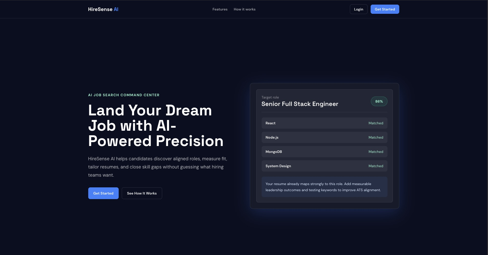

# HireSense AI

HireSense AI is a full-stack job search and resume optimization platform. It combines authenticated candidate profiles, MongoDB-backed job discovery, resume parsing for PDF/DOCX files, Gemini-powered match analysis, tailored resume generation, personalized cover letters, skill-gap learning recommendations, and saved job tracking.

<p align="center">
  
</p>

## Features

- JWT authentication with bcrypt password hashing
- Profile, skills, saved jobs, and application tracking
- Job search with full-text search, skill filters, location, type, experience, and pagination
- Resume upload with MIME validation, 5MB limit, PDF/DOCX text extraction, and Gemini structured parsing
- AI match score, optimized resume generation, cover letter generation, and skill-gap resources
- Recommendation engine using skill overlap against active jobs
- Vercel-ready React client and Render-ready Express API

## Prerequisites

- Node.js 18+
- MongoDB running locally or a MongoDB Atlas URI
- Google Gemini API key with access to `gemini-2.5-flash`

## Local Setup

1. Install backend dependencies:

```bash
cd server
npm install
cp .env.example .env
```

2. Configure `server/.env`:

```bash
PORT=5000
MONGODB_URI=mongodb://localhost:27017/hiresense
JWT_SECRET=replace_with_a_long_random_secret
GEMINI_API_KEY=your_gemini_api_key
CLIENT_URL=http://localhost:5173
```

3. Start the backend:

```bash
npm run dev
```

4. In a second terminal, install frontend dependencies:

```bash
cd client
npm install
cp .env.example .env
```

5. Configure `client/.env`:

```bash
VITE_API_URL=http://localhost:5000/api
```

6. Start the frontend:

```bash
npm run dev
```

The client runs at `http://localhost:5173` and the API runs at `http://localhost:5000`.

## Seed The Database

From `server/`, run:

```bash
npm run seed
```

This clears existing jobs and inserts 32 realistic listings across software engineering, data, ML, DevOps, design, product, and AI roles.

## API Documentation

All responses use:

```json
{ "success": true, "data": {} }
```

or:

```json
{ "success": false, "message": "Error description" }
```

### Auth

`POST /api/auth/register`

Request:

```json
{ "name": "Ava Patel", "email": "ava@example.com", "password": "secret123" }
```

Response:

```json
{ "success": true, "data": { "token": "jwt", "user": { "name": "Ava Patel", "email": "ava@example.com" } } }
```

`POST /api/auth/login`

Request:

```json
{ "email": "ava@example.com", "password": "secret123" }
```

`GET /api/auth/me` requires `Authorization: Bearer <token>`.

`PUT /api/auth/profile` requires auth.

Request:

```json
{ "name": "Ava Patel", "profileSummary": "Full stack engineer", "skills": ["React", "Node.js"] }
```

### Jobs

`GET /api/jobs?role=engineer&location=Remote&skills=React,Node.js&type=Remote&experience=Mid&page=1&limit=10`

Response includes:

```json
{ "success": true, "data": { "jobs": [], "pagination": { "page": 1, "limit": 10, "total": 32, "pages": 4 } } }
```

`GET /api/jobs/:id`

`POST /api/jobs/save/:id` requires auth and toggles saved state.

`GET /api/jobs/saved` requires auth.

`POST /api/jobs/seed` seeds jobs for development.

### Resume

`POST /api/resume/upload` requires auth and multipart field `resume`.

Response:

```json
{ "success": true, "data": { "resume": { "originalFileName": "resume.pdf", "parsedData": { "skills": ["React"] } } } }
```

`GET /api/resume` returns the latest resume for the user.

`DELETE /api/resume/:id` deletes a resume owned by the user.

### AI

`POST /api/ai/match-score` requires auth.

Request:

```json
{ "jobId": "job_id", "deep": true }
```

Response:

```json
{ "success": true, "data": { "matchScore": 86, "matchingSkills": ["React"], "missingSkills": ["AWS"], "summary": "Strong fit." } }
```

`POST /api/ai/generate-resume`

Request:

```json
{ "jobId": "job_id" }
```

`POST /api/ai/generate-cover-letter`

Request:

```json
{ "jobId": "job_id" }
```

`POST /api/ai/skill-gap`

Request:

```json
{ "missingSkills": ["AWS", "Kubernetes"] }
```

`GET /api/ai/recommendations` returns the top 5 job recommendations.

`GET /api/ai/applications` returns recent generated/analyzed applications for the dashboard.
